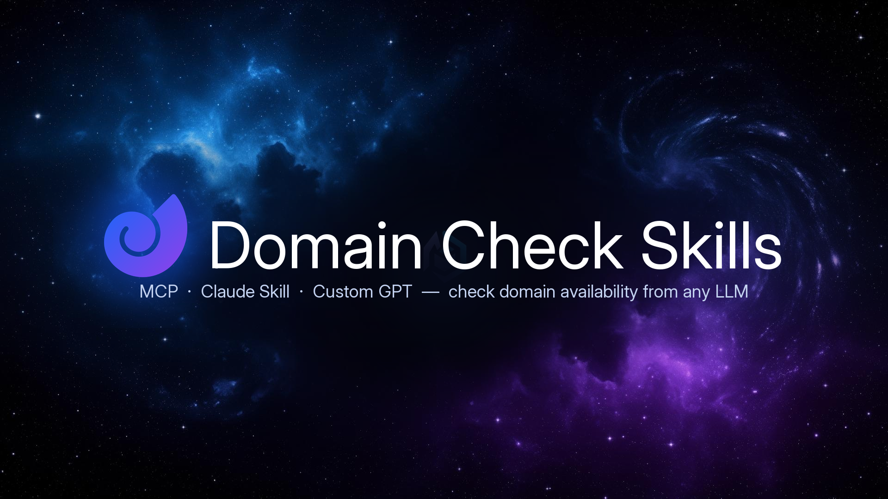

<p align="center">
  
</p>

<h1 align="center">Domain Check Skills</h1>

<p align="center">
  <strong>Check domain availability from any LLM.</strong><br/>
  MCP server · Claude Skill · Custom GPT — 7 registrars, 52 TLDs, no hallucinations.
</p>

<p align="center">
  <a href="https://digmyname.com"></a>
  <a href="LICENSE"></a>
  
</p>

> 🔍 **Prefer a web UI?** → **[digmyname.com](https://digmyname.com)** — free, no signup, live availability across 52 TLDs and 7 registrars.

---

## The problem

Ask ChatGPT or Claude *"is `foobar.com` available?"* and it confidently invents an answer. LLMs were trained on stale WHOIS dumps and have no live network access. Users buy parked domains, miss premium pricing, and waste hours cross-checking registrars.

## The solution

**Domain Check Skills** plugs real-time domain availability into the LLMs you already use. Three drop-in formats:

| Format | For | Install |
|---|---|---|
| 🧩 **MCP server** | Claude Desktop, Cursor, Windsurf, Continue, any MCP client | [`/mcp`](./mcp) |
| 🎯 **Claude Skill** | Claude.ai web/desktop (Skills) | [`/skill`](./skill) |
| 🤖 **Custom GPT** | ChatGPT Plus/Team | [`/gpt`](./gpt) |

All three call the same backend — the live engine behind [digmyname.com](https://digmyname.com).

---

## Tools exposed

| Tool | What it does |
|---|---|
| `check_domain` | Live availability for one domain (Domainr + RDAP + DNS + Porkbun cross-check). Never returns "Taken" when uncertain. |
| `search_domains` | Suggest a base name across 12 popular TLDs in parallel. |
| `get_registrars` | Side-by-side pricing across 7 registrars (Porkbun, Namecheap, Cloudflare, GoDaddy, Spaceship, Dynadot, NameSilo) — including 3-year value. |

Detailed schemas in [`/mcp/src/index.ts`](./mcp/src/index.ts).

---

## Why three formats?

- **MCP** is the open standard — works with Claude Desktop, Cursor, Windsurf, Continue, Zed, and any future MCP client. One install, every tool.
- **Claude Skill** is the lowest-friction path for non-developers on claude.ai — drop in a folder, done.
- **Custom GPT** opens the same capability to the 200M+ ChatGPT users who don't have MCP.

Pick the one that matches where you live; the backend and accuracy are identical.

---

## Quick start (MCP)

```bash
npx -y domain-check-skills-mcp
```

Or add to your client config (Claude Desktop example, `claude_desktop_config.json`):

```json
{
  "mcpServers": {
    "domain-check-skills": {
      "command": "npx",
      "args": ["-y", "domain-check-skills-mcp"]
    }
  }
}
```

Restart your client. Ask: *"Check if `myidea.com` and `myidea.io` are available."*

Full per-client guides in [`/mcp/README.md`](./mcp/README.md).

---

## Roadmap

- [ ] Publish to npm as `domain-check-skills-mcp`
- [ ] Python port for MCP server
- [ ] Cloudflare Workers deployment template
- [ ] German / Spanish / Russian translations
- [ ] More registrars (Hover, Gandi, Internet.bs)
- [ ] WHOIS history lookups (recently expired domains)
- [ ] Bulk CSV check via MCP resource

PRs welcome — see [CONTRIBUTING.md](./CONTRIBUTING.md).

---

## About DigMyName

This repo is open-sourced by the team behind **[DigMyName](https://digmyname.com)** — a free domain search engine built for humans who want to compare registrars without signing up for ten of them.

- 🌐 **Web app**: [digmyname.com](https://digmyname.com) — instant search, live availability, no signup
- 💰 **Pricing comparison**: [digmyname.com/pricing](https://digmyname.com/pricing) — 52 TLDs × 7 registrars
- ⭐ **Favorites**: [digmyname.com/favorites](https://digmyname.com/favorites) — save names for later
- 📖 **How it works**: [digmyname.com/how-it-works](https://digmyname.com/how-it-works) — sources, accuracy, methodology
- 🤖 **For LLMs**: [`/llms.txt`](https://digmyname.com/llms.txt) · [`/.well-known/ai-plugin.json`](https://digmyname.com/.well-known/ai-plugin.json)

If this saved you from buying a parked domain — **star the repo ⭐** and tell a friend who keeps asking ChatGPT for domain ideas.

---

## License

MIT — see [LICENSE](./LICENSE). Use it, fork it, ship it.
